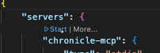
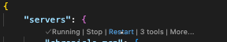

# Vertical Slices MCP

[](https://discord.gg/kt4AMpV8WV)
[](https://hub.docker.com/r/cratis/vertical-slices-mcp)
[](https://github.com/Cratis/VerticalSlices/actions/workflows/build.yml)
[](https://github.com/Cratis/VerticalSlices/actions/workflows/publish.yml)

## Using

The Vertical Slices MCP server leverages Stdio and is packaged as a container.
In your tool, configure it using that.

### Example: VSCode

In VSCode you would do this by adding a tool to your agent.
This can done either by adding it to the global user settings or through an `mcp.json` file in
the `.vscode` folder of your project.

For the global user settings, you simply do the following:

```json
"mcp": {
    "servers": {
        "VerticalSlices": {
            "type": "stdio",
            "command": "docker",
            "args": [
                "run",
                "-i",
                "--rm",
                "cratis/vertical-slices-mcp"
            ]
        }
    }
}
```

For a local `mcp.json` file, its almost the same:

```json
{
    "servers": {
        "VerticalSlices": {
            "type": "stdio",
            "command": "docker",
            "args": [
                "run",
                "-i",
                "--rm",
                "cratis/vertical-slices-mcp"
            ]
        }
    }
}
```

You can see this in action in the [mcp.json](./.vscode/mcp.json) in this repository.

> Note: The `cratis/vertical-slices-mcp` is a multi CPU architecture image supporting both x64 and arm64 automatically.

## Prompts / Tools

## Local development

Using VSCode, the [mcp.json](./.vscode/mcp.json) in the `.vscode` folder of this repository is automatically supported.
Open it and click the **Start** button:



During development, compile and click the **Restart** button when having the `mcp.json` open:


